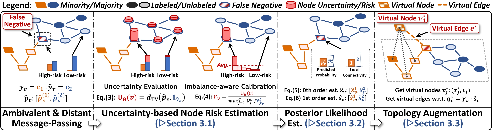
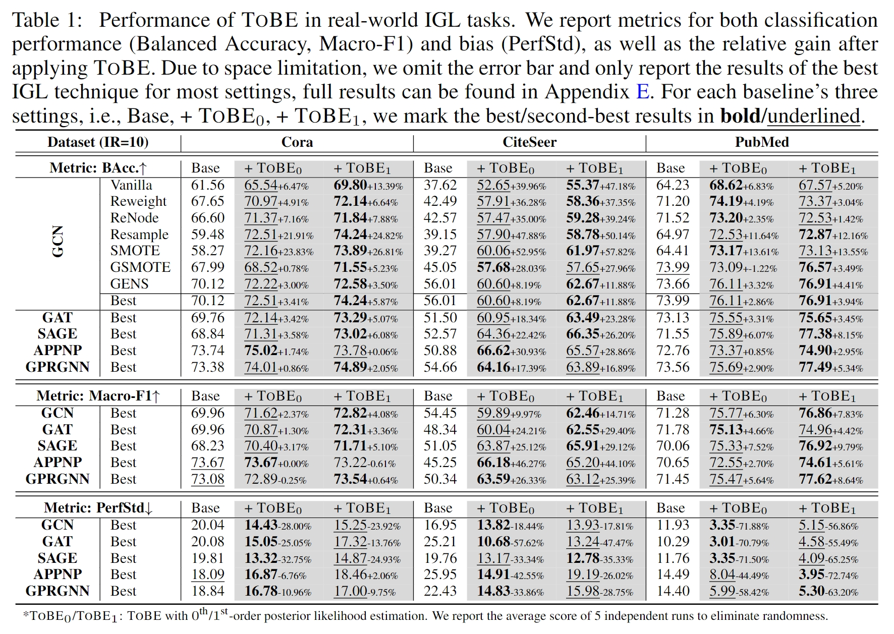
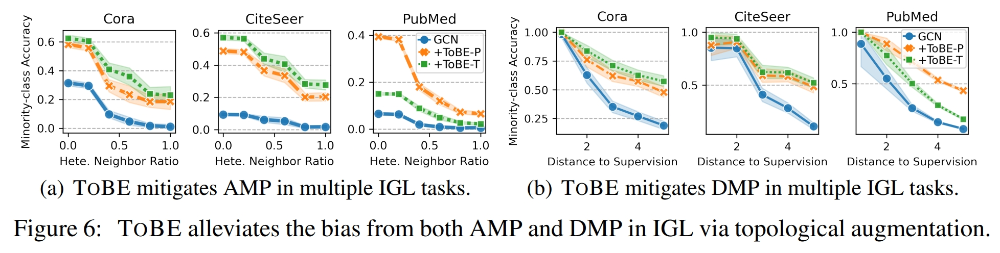

<h1 align="center">
  Topological Balanced augmEntation (ToBE)
</h1>

**ToBE** (Topological Balanced augmEntation) is a **lightweight, plug-and-play** graph data augmentation technique for class-imbalanced node classification tasks. It aims to mitigate the **class-imbalance bias** introduced by **ambivalent and distant message-passing** by dynamically identifying and rectifying nodes that are exposed to such issues. Our **ToBE** implementation features:

- &#x1F34E; **Plug-and-play**: model-agnostic augmentation that directly integrates into the training loop.
- &#x1F34E; **Effectiveness**: boosting classification performance, while reducing predictive bias.
- &#x1F34E; **Versatility**: work with various GNN architectures and imbalance-handling techniques.
- &#x1F34E; **Lightweight**: light computational overhead, no additional hyperparameters.
- &#x1F34E; **Ease-of-use**: unified, concise, and extensible API design.

**Intergrating [`TopoBalanceAugmenter`](https://github.com/AnonAuthorAI/ToBE/blob/main/tobe.py#L170) (*ToBE*) into your training loop with <5 lines of code:**

```python
from tobe import TopoBalanceAugmenter

augmenter = TopoBalanceAugmenter().init_with_data(data)

for epoch in range(epochs):
    # augment the graph
    x, edge_index, _ = augmenter.augment(model, x, edge_index)
    y, train_mask = augmenter.adapt_labels_and_train_mask(y, train_mask)
    # original training step
    model.update(x, y, edge_index, train_mask)
```

### Table of Contents
- [Main Dependencies](#main-dependencies)
- [Usage](#usage)
  - [Command line](#command-line)
  - [Jupyter Notebook](#jupyter-notebook)
- [API reference](#api-reference)
  - [TopoBalanceAugmenter](#topobalanceaugmenter)
  - [NodeClassificationTrainer](#nodeclassificationtrainer)
- [Emprical Results](#emprical-results)
  - [Experimental Setup](#experimental-setup)
  - [On the effectiveness and versatility of TOBA](#on-the-effectiveness-and-versatility-of-toba)
  - [On the robustness of TOBA](#on-the-robustness-of-toba)
  - [On mitigating AMP and DMP](#on-mitigating-amp-and-dmp)
- [References](#references)

## Main Dependencies

- Python: 3.9.12
- pytorch: 1.12.1
- torch_geometric: 2.3.0
- sklearn: 1.2.1
- numpy: 1.21.5
- pandas: 1.4.2
- tqdm: 4.64.0

## Usage

### Command line

[`train.py`](https://github.com/AnonAuthorAI/ToBE/blob/main/train.py) provides a simple way to test ToBE under different settings: datasets, imbalance types, imbalance ratios, GNN architectures, etc. 
For example, to test ToBE's effectiveness on the Cora dataset with a 10:1 step imbalance ratio using the GCN architecture, simply run:
```bash
python train.py --dataset cora --imb_type step --imb_ratio 10 --gnn_arch GCN --tobe_mode all
```

Output:
```
================= Dataset [Cora] - StepIR [10] - ToBE [dummy] =================
Best Epoch:   97 | train/val/test | BACC: 85.71/61.60/60.74 | MACRO-F1: 89.78/58.04/59.09 | node/edge ratio: 100.00/100.00% 
Best Epoch:  122 | train/val/test | BACC: 71.43/57.82/55.99 | MACRO-F1: 70.08/53.30/51.88 | node/edge ratio: 100.00/100.00% 
Best Epoch:  132 | train/val/test | BACC: 100.0/63.83/62.47 | MACRO-F1: 100.0/62.23/60.79 | node/edge ratio: 100.00/100.00% 
Best Epoch:   60 | train/val/test | BACC: 100.0/61.60/60.74 | MACRO-F1: 100.0/58.04/59.09 | node/edge ratio: 100.00/100.00% 
Best Epoch:  151 | train/val/test | BACC: 100.0/57.82/55.99 | MACRO-F1: 100.0/53.30/51.88 | node/edge ratio: 100.00/100.00% 
Avg Test Performance (5 runs):  | BACC: 59.19 ± 1.20 | MACRO-F1: 56.55 ± 1.72

================== Dataset [Cora] - StepIR [10] - ToBE [pred] ==================
Best Epoch:  134 | train/val/test | BACC: 100.0/67.12/65.83 | MACRO-F1: 100.0/63.63/63.12 | node/edge ratio: 100.26/102.97% 
Best Epoch:  141 | train/val/test | BACC: 100.0/71.83/68.17 | MACRO-F1: 100.0/69.45/66.30 | node/edge ratio: 100.26/103.18% 
Best Epoch:  134 | train/val/test | BACC: 100.0/71.94/70.33 | MACRO-F1: 100.0/69.88/68.94 | node/edge ratio: 100.26/102.88% 
Best Epoch:  305 | train/val/test | BACC: 100.0/66.65/65.55 | MACRO-F1: 100.0/64.05/63.93 | node/edge ratio: 100.26/103.11% 
Best Epoch:  316 | train/val/test | BACC: 100.0/62.95/60.66 | MACRO-F1: 100.0/59.56/58.63 | node/edge ratio: 100.26/103.32% 
Avg Test Performance (5 runs):  | BACC: 66.11 ± 1.44 | MACRO-F1: 64.18 ± 1.54

================== Dataset [Cora] - StepIR [10] - ToBE [topo] ==================
Best Epoch:   81 | train/val/test | BACC: 100.0/69.67/68.66 | MACRO-F1: 100.0/67.24/66.88 | node/edge ratio: 100.26/101.45% 
Best Epoch:  428 | train/val/test | BACC: 100.0/73.40/69.96 | MACRO-F1: 100.0/72.77/69.26 | node/edge ratio: 100.26/101.72% 
Best Epoch:  117 | train/val/test | BACC: 100.0/75.62/73.93 | MACRO-F1: 100.0/71.35/70.81 | node/edge ratio: 100.26/101.54% 
Best Epoch:   71 | train/val/test | BACC: 100.0/69.50/67.75 | MACRO-F1: 100.0/68.11/66.80 | node/edge ratio: 100.26/101.54% 
Best Epoch:   77 | train/val/test | BACC: 100.0/78.03/77.92 | MACRO-F1: 100.0/75.06/76.42 | node/edge ratio: 100.26/101.60% 
Avg Test Performance (5 runs):  | BACC: 71.64 ± 1.69 | MACRO-F1: 70.03 ± 1.58
```

The default experiment settings (arguments) are specified in the configuration file [`config.yaml`](https://github.com/AnonAuthorAI/ToBE/blob/main/config.yaml).
Arguments specified via command line will override the default settings in the config file.
Full argument list and descriptions are as follows:

```
--gpu_id | int, default=0
    Specify which GPU to use for training. Set to -1 to use the CPU.

--seed | int, default=42
    Random seed for reproducibility in training.

--n_runs | int, default=5
    The number of independent runs for training.

--debug | bool, default=False
    Enable debug mode if set to True.

--dataset | str, default="cora"
    Name of the dataset to use for training.
    Supports "cora," "citeseer," "pubmed," "cs", "physics".

--imb_type | str, default="step", choices=["step", "natural"]
    Type of imbalance to handle in the dataset. Choose from "step" or "natural".

--imb_ratio | int, default=10
    Imbalance ratio for handling imbalanced datasets.

--gnn_arch | str, default="GCN", choices=["GCN", "GAT", "SAGE"]
    Graph neural network architecture to use. Choose from "GCN," "GAT," or "SAGE."

--n_layer | int, default=3
    The number of layers in the GNN architecture.

--hid_dim | int, default=256
    Hidden dimension size for the GNN layers.

--lr | float, default=0.01
    Initial learning rate for training.

--weight_decay | float, default=5e-4
    Weight decay for regularization during training.

--epochs | int, default=2000
    The number of training epochs.

--early_stop | int, default=200
    Patience for early stopping during training.

--tqdm | bool, default=False
    Enable a tqdm progress bar during training if set to True.

--tobe_mode | str, default="all", choices=["dummy", "pred", "topo", "all"]
    Mode of the ToBE. Choose from "dummy," "pred," "topo," or "all."
    if "dummy," ToBE is disabled.
    if "pred," ToBE is enabled with only prediction-based augmentation.
    if "topo," ToBE is enabled with only topology-based augmentation.
    if "all," will run all modes and report the result for comparison.
```

### Jupyter Notebook

We also provide an example jupyter notebook [train_notebook.ipynb](https://github.com/AnonAuthorAI/ToBE/blob/main/train_notebook.ipynb) with experimental results for all combinations of following settings:

| Setting         | (Default) Values                           | Description                                                        |
| --------------- | ------------------------------------------ | ------------------------------------------------------------------ |
| `DATASET_SPACE` | `['cora', 'citeseer', 'pubmed']`           | The datasets to use.                                               |
| `IMB_TYPES`     | `{'step': [10, 20], 'natural': [50, 100]}` | The imbalance types and ratios.                                    |
| `TOBE_MODES`    | `['dummy', 'pred', 'topo']`                | The ToBE modes to test, `dummy` means no topological augmentation. |


## API reference

### TopoBalanceAugmenter

https://github.com/AnonAuthorAI/ToBE/blob/main/tobe.py#L170

Main class that implements the ToBE augmentation algorithm, inheriting from [`BaseGraphAugmenter`](https://github.com/AnonAuthorAI/ToBE/blob/main/tobe.py#L11). Implements 3 core steps of ToBE: 
- (1) node risk estimation
- (2) candidate class selection
- (3) virtual topology augmentation.

```python
class TopoBalanceAugmenter(BaseGraphAugmenter):
    """
    Topological Balanced augmEntation (ToBE) for graph data.

    Parameters:
    - mode: str, optional (default: "pred")
        The augmentation mode. Must be one of ["dummy", "pred", "topo"].
    - random_state: int or None, optional (default: None)
        Random seed for reproducibility.
    """
```

Core methods:
- `init_with_data(data)`: initialize the augmenter with graph data.
  - Parameters: 
    - `data` : PyG data object
  - Return: 
    - `self` : TopoBalanceAugmenter
- `augment(model, x, edge_index)`: perform topology-aware graph augmentation.
  - Parameters: 
    - `model` : torch.nn.Module, node classification model
    - `x` : torch.Tensor, node feature matrix
    - `edge_index` : torch.Tensor, sparse edge index
  - Return: 
    - `x_aug` : torch.Tensor, augmented node feature matrix
    - `edge_index_aug`: torch.Tensor, augmented sparse edge index
    - `info` : dict, augmentation info
- `adapt_labels_and_train_mask(y, train_mask)`: adapt labels and training mask after augmentation.
  - Parameters: 
    - `y` : torch.Tensor, node label vector
    - `train_mask` : torch.Tensor, training mask
  - Return: 
    - `new_y` : torch.Tensor, adapted node label vector
    - `new_train_mask` : torch.Tensor, adapted training mask

### NodeClassificationTrainer

https://github.com/AnonAuthorAI/ToBE/blob/main/trainer.py#L14

Trainer class for node classification tasks, centralizing the training workflow: 
- (1) model preparation and selection
- (2) performance evaluation
- (3) data augmentation
- (4) verbose logging.

```python
class NodeClassificationTrainer:
    """
    A trainer class for node classification with Graph Augmenter.

    Parameters:
    -----------
    - model: torch.nn.Module
        The node classification model.
    - data: pyg.data.Data
        PyTorch Geometric data object containing graph data.
    - device: str or torch.device
        Device to use for computations (e.g., 'cuda' or 'cpu').
    - augmenter: BaseGraphAugmenter, optional
        Graph augmentation strategy.
    - learning_rate: float, optional
        Learning rate for optimization.
    - weight_decay: float, optional
        Weight decay (L2 penalty) for optimization.
    - train_epoch: int, optional
        Number of training epochs.
    - early_stop_patience: int, optional
        Number of epochs with no improvement to trigger early stopping.
    - eval_freq: int, optional
        Frequency of evaluation during training.
    - eval_metrics: dict, optional
        Dictionary of evaluation metrics and associated functions.
    - verbose_freq: int, optional
        Frequency of verbose logging.
    - verbose_config: dict, optional
        Configuration for verbose logging.
    - save_model_dir: str, optional
        Directory to save model checkpoints.
    - save_model_name: str, optional
        Name of the saved model checkpoint.
    - enable_tqdm: bool, optional
        Whether to enable tqdm progress bar.
    - random_state: int, optional
        Seed for random number generator.
    """
```

Core methods:
- `train`: train the node classification model and perform evaluation.
  - Parameters:
    - `train_epoch`: int, optional. Number of training epochs.
    - `eval_freq`: int, optional. Frequency of evaluation during training.
    - `verbose_freq`: int, optional. Frequency of verbose logging.
  - Return:
    - `model`: torch.nn.Module, trained node classification model.
- `print_best_results`: print the evaluation results of the best model.

## Emprical Results

### Experimental Setup

To fully validate **ToBE**'s performance and compatibility with existing IGL techniques and GNN backbones, we test 6 baseline methods with 5 popular GNN backbone architectures in our experiments, and apply ToBE with them under all possible combinations:

- **Datasets**: Cora, Citeseer, Pubmed, CS, Physics
- **Imbalance-handling techniques**: 
  - Reweighting [1]
  - ReNode [2]
  - Oversample [3]
  - SMOTE [4]
  - GraphSMOTE [5]
  - GraphENS [6]
- **GNN backbones**:
  - GCN [7]
  - GAT [8]
  - SAGE [9]
  - APPNP [10]
  - GPRGNN [11]
- **Imbalance types & ratios**: 
  - **Step imbalance**: 10:1, 20:1
  - **Natural imbalance**: 50:1, 100:1

### On the effectiveness and versatility of TOBA

We first report the detailed empirical results of applying **ToBE** with 6 IGL baselines and 5 GNN backbones on 3 imbalanced graphs (Cora, CiteSeer, and PubMed) with IR=10 in Table 1. In all 3 (datasets) x 5 (backbones) x 7 (baselines) x 2 (name variants) x 3 (metrics) = **630 setting combinations**, it achieves significant and consistent performance improvements on the basis of other IGL techniques, which also yields new state-of-the-art performance. In addition to the superior performance in boosting classification, **ToBE** also greatly reduces the model predictive bias.




### On the robustness of TOBA

We now test **ToBE**'s robustness to varying types of extreme class-imbalance. In this experiment, we extend Table `main` and consider a more challenging scenario with IR = 20. In addition, we consider the natural (long-tail) class imbalance that is commonly observed in real-world graphs with IR of 50 and 100. Datasets from (*CS, Physics*) are also included to test **ToBE**'s performance on large-scale tasks. Results show that **ToBE** consistently demonstrates superior performance in boosting classification and reducing predictive bias.


### On mitigating AMP and DMP

We further design experiments to verify whether **ToBE** can effectively handle the topological challenges identified in this paper, i.e., ambivalent and distant message-passing. Specifically, we investigate whether **ToBE** can improve the prediction accuracy of minority class nodes that are highly influenced by ambivalent/distant message-passing, i.e., high local heterophilic ratios/long distance to supervision signals. Results are shown in the figure below (5 independent runs with GCN classifier, IR=10). As can be observed, **ToBE** effectively alleviates the negative impact of AMP and DMP and helps node classifiers to achieve better performance in minority classes.



## References

| #    | Reference                                                                                                                                                                                                                                  |
| ---- | ------------------------------------------------------------------------------------------------------------------------------------------------------------------------------------------------------------------------------------------ |
| [1]  | Nathalie Japkowicz and Shaju Stephen. The class imbalance problem: A systematic study. Intelligent data analysis, 6(5):429–449, 2002.                                                                                                      |
| [2]  | Deli Chen, Yankai Lin, Guangxiang Zhao, Xuancheng Ren, Peng Li, Jie Zhou, and Xu Sun. Topology-imbalance learning for semi-supervised node classification. Advances in Neural Information Processing Systems, 34:29885–29897, 2021.        |
| [3]  | Nathalie Japkowicz and Shaju Stephen. The class imbalance problem: A systematic study. Intelligent data analysis, 6(5):429–449, 2002.                                                                                                      |
| [4]  | Nitesh V Chawla, Kevin W Bowyer, Lawrence O Hall, and W Philip Kegelmeyer. Smote: synthetic minority over-sampling technique. Journal of artificial intelligence research, 16:321–357, 2002.                                               |
| [5]  | Tianxiang Zhao, Xiang Zhang, and Suhang Wang. Graphsmote: Imbalanced node classification on graphs with graph neural networks. In Proceedings of the 14th ACM international conference on web search and data mining, pages 833–841, 2021. |
| [6]  | Joonhyung Park, Jaeyun Song, and Eunho Yang. Graphens: Neighbor-aware ego network synthesis for class-imbalanced node classification. In International Conference on Learning Representations, 2022.                                       |
| [7]  | Max Welling and Thomas N Kipf. Semi-supervised classification with graph convolutional networks. In J. International Conference on Learning Representations (ICLR 2017), 2016.                                                             |
| [8]  | Petar Veliˇckovi ́c, Guillem Cucurull, Arantxa Casanova, Adriana Romero, Pietro Liò, and Yoshua Bengio. Graph attention networks. In International Conference on Learning Representations, 2018.                                            |
| [9]  | Will Hamilton, Zhitao Ying, and Jure Leskovec. Inductive representation learning on large graphs. Advances in neural information processing systems, 30, 2017.                                                                             |
| [10] | Johannes Gasteiger, Aleksandar Bojchevski, and Stephan Günnemann. Predict then propagate: Graph neural networks meet personalized pagerank. arXiv preprint arXiv:1810.05997, 2018.                                                         |
| [11] | Eli Chien, Jianhao Peng, Pan Li, and Olgica Milenkovic. Adaptive universal generalized pagerank graph neural network. arXiv preprint arXiv:2006.07988, 2020.                                                                               |
